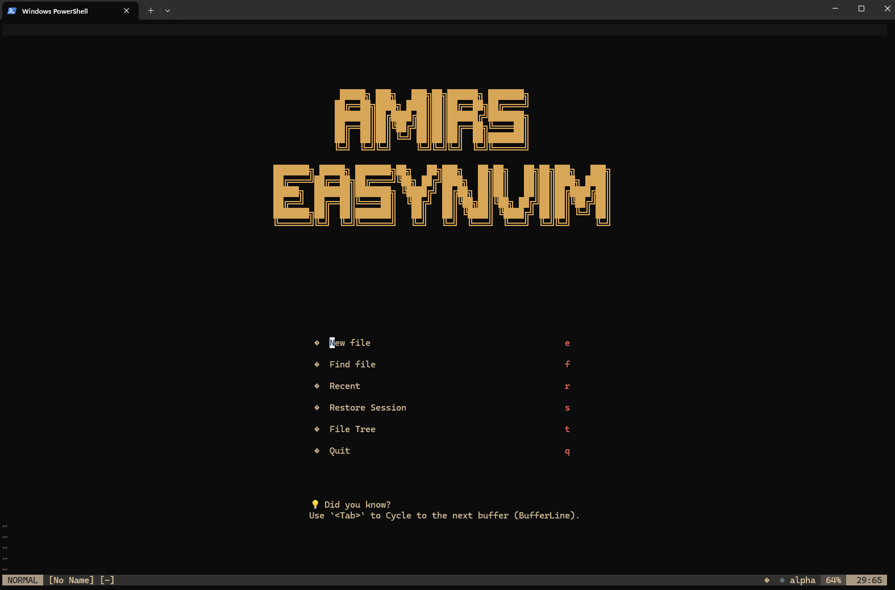
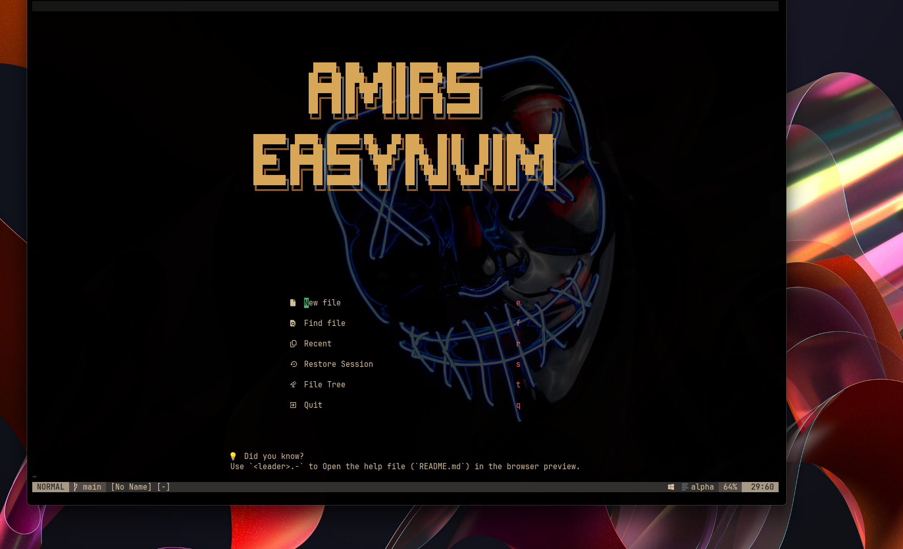
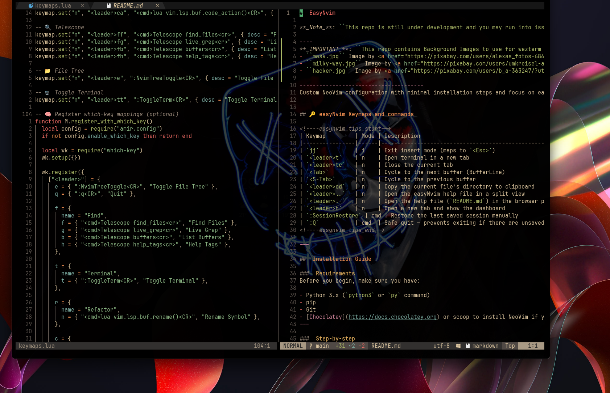

#  EasyNvim

**_Note_**: ``This repo is still under development and you may run into issues, if so please let me know about them or create an issue/pull request``

----
**_IMPORTANT_**: ``This repo contains Background Images to use for wezterm as an example, they are free to use images from Pixaby:``
- ``mask.jpg`` Image by <a href="https://pixabay.com/users/alexas_fotos-686414/?utm_source=link-attribution&utm_medium=referral&utm_campaign=image&utm_content=3986332">Alexa</a> from <a href="https://pixabay.com//?utm_source=link-attribution&utm_medium=referral&utm_campaign=image&utm_content=3986332">Pixabay</a>
- ``milky-way.jpg`` Image by <a href="https://pixabay.com/users/umkreisel-app-4397258/?utm_source=link-attribution&utm_medium=referral&utm_campaign=image&utm_content=5295160">Umkreisel-App</a> from <a href="https://pixabay.com//?utm_source=link-attribution&utm_medium=referral&utm_campaign=image&utm_content=5295160">Pixabay</a>
- ``hacker.jpg`` Image by <a href="https://pixabay.com/users/b_a-363247/?utm_source=link-attribution&utm_medium=referral&utm_campaign=image&utm_content=3342696">B_A</a> from <a href="https://pixabay.com//?utm_source=link-attribution&utm_medium=referral&utm_campaign=image&utm_content=3342696">Pixabay</a>

--------------------------------------
Custom NeoVim configuration with minimal installation steps and focus on ease-of-use, speed, and modern UI features.


## 🔑 easyNvim Keymaps and commands

<!----easynvim_tips_start-->
| Keymap         | Mode | Description                                                |
|----------------|------|------------------------------------------------------------|
| `jj`           | i    | Exit insert mode (maps to `<Esc>`)                         |
| `<leader>t`    | n    | Open terminal in a new tab                                 |
| `<leader>tc`   | n    | Close the current tab                                      |
| `<Tab>`        | n    | Cycle to the next buffer (BufferLine)                      |
| `<S-Tab>`      | n    | Cycle to the previous buffer                               |
| `<leader>cd`   | n    | Copy the current file’s directory to clipboard             |
| `<leader>..`   | n    | Open the easyNvim help file in a split view                |
| `<leader>.-`   | n    | Open the help file (`README.md`) in the browser preview    |
| `<leader>h`    | n    | Open a new tab and show the dashboard                      |
| `:SessionRestore` | cmd | Restore the last saved session manually                  |
| `:Q`           | cmd  | Safe quit — prevents exiting if there are unsaved buffers  |
<!----easynvim_tips_end-->

---
### screenshots

<p align="center">
  
  
</p>

##  Installation Guide

###  Requirements
Before you begin, make sure you have:

- Python 3.x (`python3` or `py` command)
- pip
- Git
- [Chocolatey](https://docs.chocolatey.org) or scoop to install NeoVim if you havent already installed it.
---


###  Backing up your old Neovim config (optional)
If you already have a Neovim setup, it’s smart to back it up first:

```bash
mkdir -p ~/nvim_backup
cp -r ~/.config/nvim ~/nvim_backup/
cp -r ~/.local/share/nvim ~/nvim_backup/
cp -r ~/.cache/nvim ~/nvim_backup/
```

---

###  Step-by-step

#### 1. Clone this repository inside any directory you like.
```bash
git clone https://github.com/alhedmi/easyNvim.git
cd easyNvim
```

#### 2. Run the install script

#####  Linux / macOS
```
chmod +x install.sh

./install.sh
```

##### Windows (️ Run PowerShell as Administrator)

>  On Windows, right-click PowerShell and choose **"Run as Administrator"**  
> to avoid permission issues when linking the config folder or installing packages.
>
>**If Windows blocks the install script, you _temporarily_ allow it using:** 
>
>    ``Set-ExecutionPolicy Bypass -Scope Process``  
```powershell
.\install.ps1 
```

---

###  What This Script Does

- Installs all dependencies (Neovim, pip packages, etc.)
- Links this repo to your Neovim config folder
- Installs [`lazy.nvim`](https://github.com/folke/lazy.nvim) and essential plugins
- Launches Neovim to sync everything

---


###  First launch

Once the install finishes:
```bash
nvim
```

Inside Neovim, wait for `lazy.nvim` to finish installing plugins.  
Then enjoy your custom setup with:

- `<leader>h` → Dashboard
- `<leader>..` → In-editor help
- `<leader>t` → Terminal tab

---

### Using Wezterm

<p align="center">
  
  
</p>

**For those who are intrested in using _wezterm_ alongside NeoVim**

Use the ``.wezterm.lua`` file from the cloned Repo to configure **wezterm** and get the full experience.

We'll have to download and install Wezterm, which is very easy to do, then add the lua config file 
to you Enviorment variables:

#### Example on Windows:

System --> Enviorment variables --> User variables: 
```
Name: WEZTERM_CONFIG_FILE | Path: "Path/to/.wezterm.lua"
```

##  Credits & License 
```
Made by Amir Alhedmi  
MIT License
```
