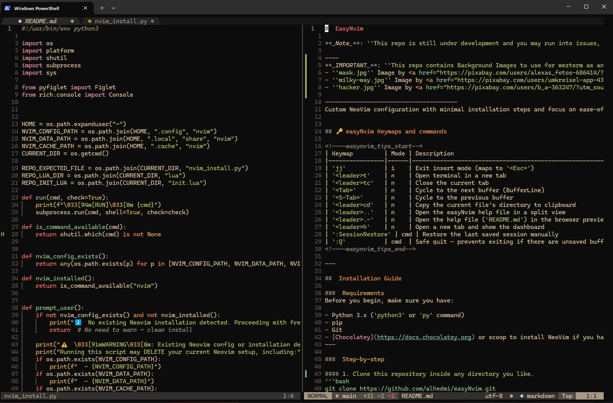

#  EasyNvim

**_Note_**: ``This repo is still under development and you may run into issues, if so please let me know about them or create an issue/pull request``

----
**_IMPORTANT_**: ``This repo contains Background Images to use for wezterm as an example, they are free to use images from Pixaby:``
- ``mask.jpg`` Image by <a href="https://pixabay.com/users/alexas_fotos-686414/?utm_source=link-attribution&utm_medium=referral&utm_campaign=image&utm_content=3986332">Alexa</a> from <a href="https://pixabay.com//?utm_source=link-attribution&utm_medium=referral&utm_campaign=image&utm_content=3986332">Pixabay</a>
- ``milky-way.jpg`` Image by <a href="https://pixabay.com/users/umkreisel-app-4397258/?utm_source=link-attribution&utm_medium=referral&utm_campaign=image&utm_content=5295160">Umkreisel-App</a> from <a href="https://pixabay.com//?utm_source=link-attribution&utm_medium=referral&utm_campaign=image&utm_content=5295160">Pixabay</a>
- ``hacker.jpg`` Image by <a href="https://pixabay.com/users/b_a-363247/?utm_source=link-attribution&utm_medium=referral&utm_campaign=image&utm_content=3342696">B_A</a> from <a href="https://pixabay.com//?utm_source=link-attribution&utm_medium=referral&utm_campaign=image&utm_content=3342696">Pixabay</a>

--------------------------------------
Custom NeoVim configuration with minimal installation steps and focus on ease-of-use, speed, and modern UI features.


## 🔑 easyNvim Keymaps and commands 
<details>
 <summary> 🔑 Click to view all keymaps</summary>

<!----easynvim_tips_start-->
| Keymap         | Mode | Description                                                |
|----------------|------|------------------------------------------------------------|
| `jj`           | i    | Exit insert mode (maps to `<Esc>`)                         |
| `jj`           | t    | Exit terminal mode                                         |
| `<C-s>`        | n/i  | Save file                                                  |
| `<C-h>`        | n    | Move to left window                                        |
| `<C-l>`        | n    | Move to right window                                       |
| `<C-j>`        | n    | Move to lower window                                       |
| `<C-k>`        | n    | Move to upper window                                       |
| `<leader>q`    | n    | Quit                                                       |
| `<leader>h`    | n    | Open dashboard (Alpha)                                     |
| `<leader>tt`   | n    | Toggle terminal                                            |
| `<leader>tn`   | n    | New tab with dashboard                                     |
| `<leader>tc`   | n    | Smart tab or buffer close                                  |
| `<leader>md`   | n    | Open File(.md) in markdown format                          |
| `<Tab>`        | n    | Cycle to next buffer                                       |
| `<S-Tab>`      | n    | Cycle to previous buffer                                   |
| `<leader>cd`   | n    | Copy active file’s directory to clipboard                  |
| `<leader>..`   | n    | Open the easyNvim help file in a split view                |
| `<leader>.-`   | n    | Open the help file (`README.md`) in the browser preview    |
| `<leader>e`    | n    | Toggle file tree                                           |
| `gd`           | n    | Go to definition                                           |
| `gr`           | n    | Show references                                            |
| `gi`           | n    | Go to implementation                                       |
| `K`            | n    | LSP hover docs                                             |
| `<leader>rn`   | n    | Rename symbol                                              |
| `<leader>ca`   | n    | Code action                                                |
| `<leader>ff`   | n    | Telescope: Find files                                      |
| `<leader>fg`   | n    | Telescope: Live grep                                       |
| `<leader>fb`   | n    | Telescope: List buffers                                    |
| `<leader>fh`   | n    | Telescope: Help tags                                       |
| `<leader>de`   | n    | Show diagnostic under cursor                               |
| `<leader>dc`   | n    | Copy all diagnostics on current line                       |
| `<leader>l`    | n    | Latex Compiler shortcut List                               |
| `<leader>ll`   | n    | start/stop the Latex compiler in continous mode            |
| `[d`           | n    | Go to previous diagnostic                                  |
| `]d`           | n    | Go to next diagnostic                                      |
| `:SessionRestore` | cmd | Restore the last saved session manually                  |
| `:Q`           | cmd  | Safe quit — prevents exiting if there are unsaved buffers  |
<!----easynvim_tips_end-->

</details>

---
### screenshots

<p align="center">
  
  
</p>

##  Installation Guide

###  Requirements
Before you begin, make sure you have:

- Python 3
- pip
- Git (to clone the Repo and link it to nvim)
- npm (node.js)
- For Windows: [Chocolatey](https://docs.chocolatey.org) or scoop 
    To Install Chocolatey on Windows with PowerShell:
    ```        
    Set-ExecutionPolicy Bypass -Scope Process -Force; `
    [System.Net.ServicePointManager]::SecurityProtocol = `
    [System.Net.ServicePointManager]::SecurityProtocol -bor 3072; `
    iex ((New-Object System.Net.WebClient).DownloadString('https://community.chocolatey.org/install.ps1'))
    ```
---


###  Backing up your old Neovim config (optional)
If you already have a Neovim setup, it’s smart to back it up first:

```bash
mkdir -p ~/nvim_backup
cp -r ~/.config/nvim ~/nvim_backup/
cp -r ~/.local/share/nvim ~/nvim_backup/
cp -r ~/.cache/nvim ~/nvim_backup/
```

---

###  Step-by-step

#### 1. Clone this repository inside any directory you like.
```bash
git clone https://github.com/alhedmi/easyNvim.git
cd easyNvim
```

#### 2. Run the install script

#####  Linux / macOS
```bash
chmod +x install.sh

./install.sh
```

##### Windows (️ Run PowerShell as Administrator)

>  On Windows, right-click PowerShell and choose **"Run as Administrator"**  
> to avoid permission issues when linking the config folder or installing packages.
>
>**If Windows blocks the install script, you _temporarily_ allow it using:** 
>
>    ``Set-ExecutionPolicy Bypass -Scope Process``  
```powershell
.\install.ps1 
```

---

###  What This Script Does

- Installs all dependencies (Neovim, pip packages, etc.)
- Links this repo to your Neovim config folder
- Installs [`lazy.nvim`](https://github.com/folke/lazy.nvim) and essential plugins
- Launches Neovim to sync everything

---


###  First launch

Once the install finishes:
```bash
nvim
```

Inside Neovim, wait for `lazy.nvim` to finish installing plugins.  
Then enjoy your custom setup with:

- `<leader>h` → Dashboard
- `<leader>..` → In-editor help
- `<leader>t` → Terminal tab

---
### Troubleshooting
> If you get the error message ``Lazy is not an Editor command`` then Symlink has probably failed due to a wrong path, 
>
> if so please run the following commands to restablish the Symlink: 
>
**For Windows**
>
> **replace Target path with the actual path you cloned this repo in.**
```bash

Remove-Item "$env:LOCALAPPDATA\nvim" -Force -Recurse
New-Item -ItemType Junction -Path "$env:LOCALAPPDATA\nvim" -Target "Path_to_cloned_Repo\myNvim_Config\easyNvim"
    
```

#### Latex compiler and viewer:
Install MiKTeX (recommended lightweight TeX engine for Windows)
```
choco install miktex --yes
```
After installing, run:

```
miktex-console
```
And configure it to install missing packages on-the-fly (or silently) for convenience.

Install SumatraPDF (best viewer for vimtex on Windows)
```
choco install sumatrapdf --yes
```
Then Install perl by running:
```
choco install strawberryperl --yes
```

That is it, you should be able to edit compile and view Latex with Neovim
open ``your-file.tex`` file with nvim and hit ``<leader>ll`` to start compiler then open ``your-file.pdf`` in **SumatraPDF** 
    ``everytime you save changes in .tex file the pdf in SumatraPDF will update automatically.``

### Using Wezterm

<p align="center">
  
  
</p>

**For those who are intrested in using _wezterm_ alongside NeoVim**

Use the ``.wezterm.lua`` file from the cloned Repo to configure **wezterm** and get the full experience.

We'll have to download and install Wezterm, which is very easy to do, then add the lua config file 
to you Enviorment variables:

#### installation

-> install from Wezterm's website : [install wezterm](https://wezterm.org/installation)

OR :

##### For Windows Windows:
```bash  
    choco install wezterm -y
```
##### For macOS:
``` 
    brew install --cask wezterm 

```
If you'd like to use a nightly build:

```
    brew install --cask wezterm@nightly
```

Then add it to the Envoirment variables:

System --> Enviorment variables --> User variables: 

```
    Name: WEZTERM_CONFIG_FILE | Path: "Path/to/.wezterm.lua"
```

##  Credits & License 
```
Made by Amir Alhedmi  
MIT License
```
